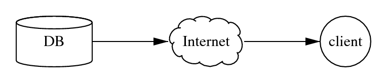

tangy
=====

tangy is picture generator.
It is inspired by pic (roff pre-processor).
Using the language, you can draw picture in EPS (Encapsuled Postscript) file.
For example, following script makes DB, client and their communication
through Internet.

    drum "DB"
    arrow
    cloud "Internet"
    arrow
    circle "client"

You can change color, hatching and line types.

	drum "A"
	arrow 
	box "B"
	arrow linetype dashed
	circle "C" fillhatch slashed fillcolor 3
	arrow linetype zigzag
	ellipse "D" fillhatch crossed fillcolor 2
	arrow linetype waved

Tangy accept ASCII, Japanese(UTF-8) and mix of them.

	box "ASCII日本語" width 2u
	move
	box "|sanserif|ASCII日本語" width 2u

Thanks.

